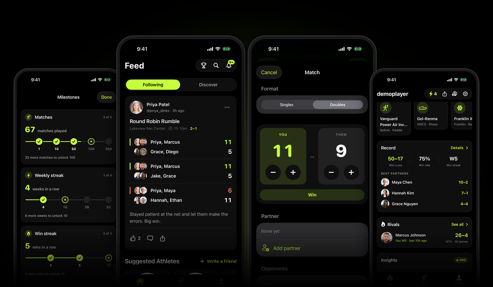
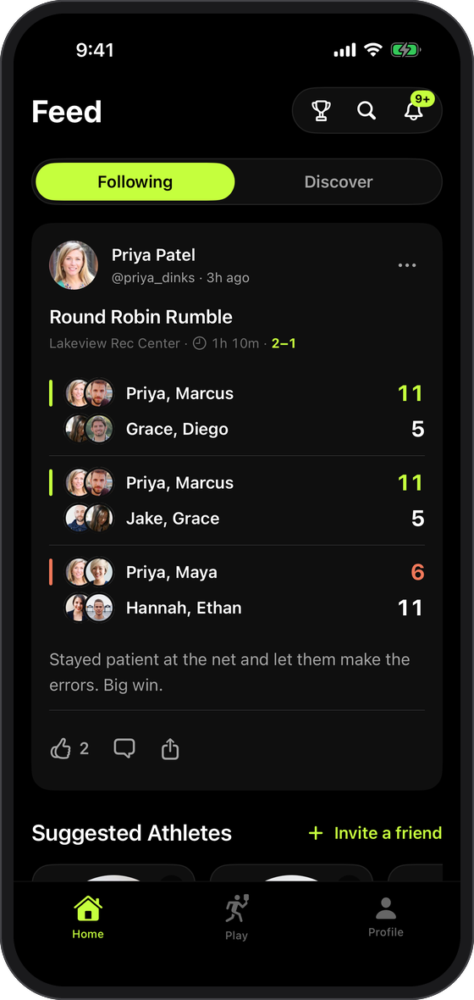
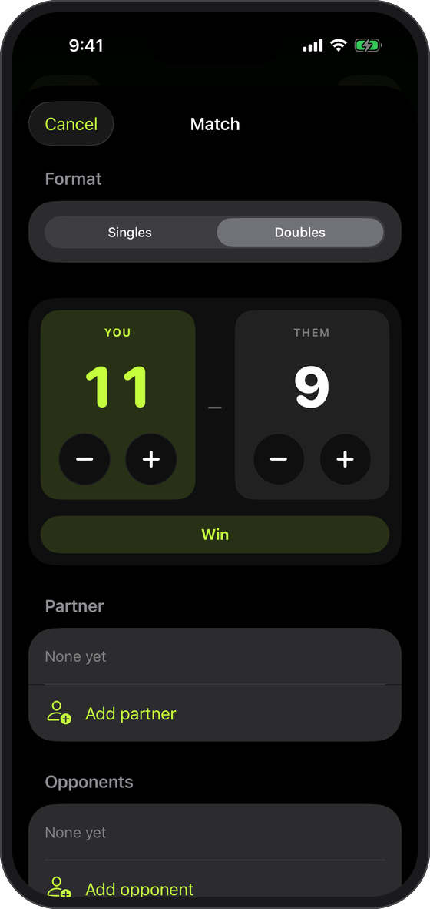
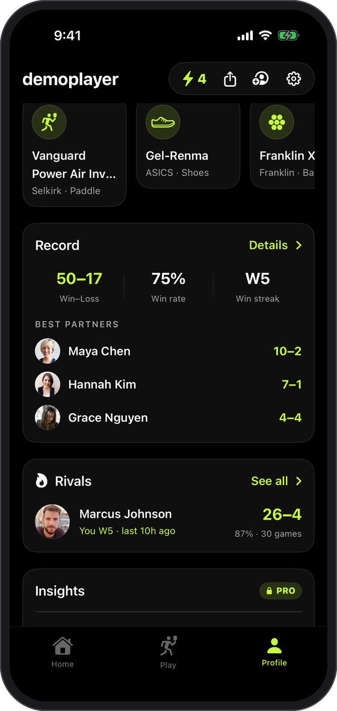
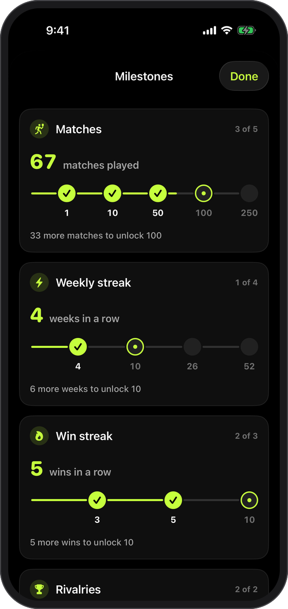
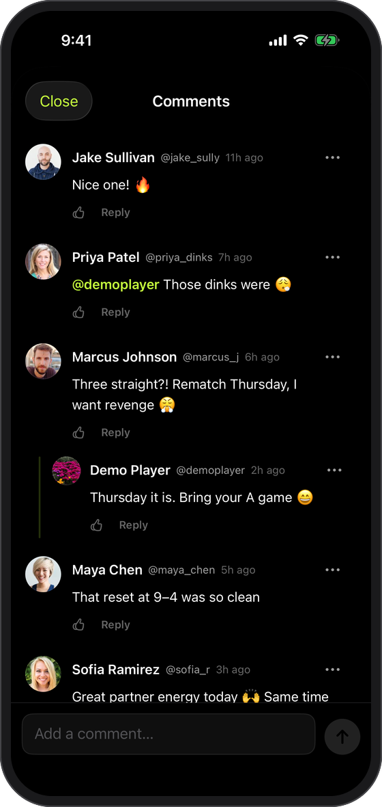
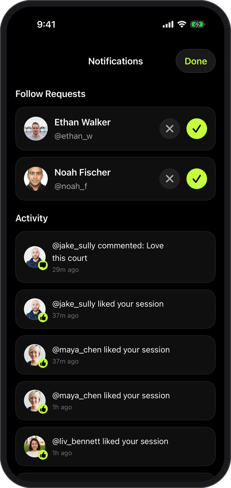
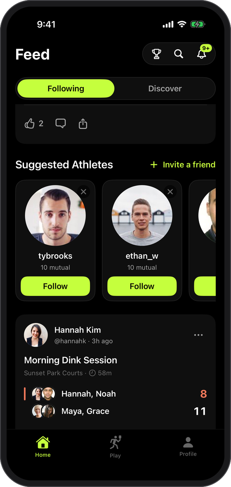
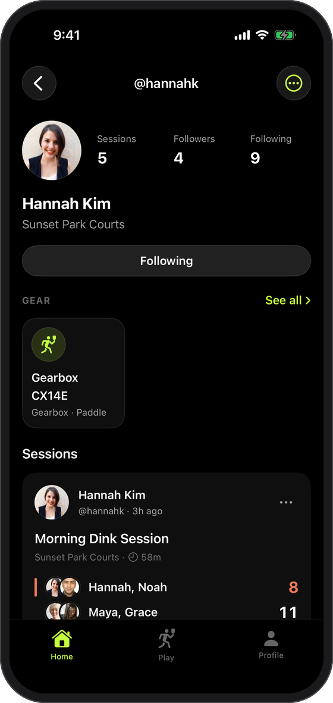
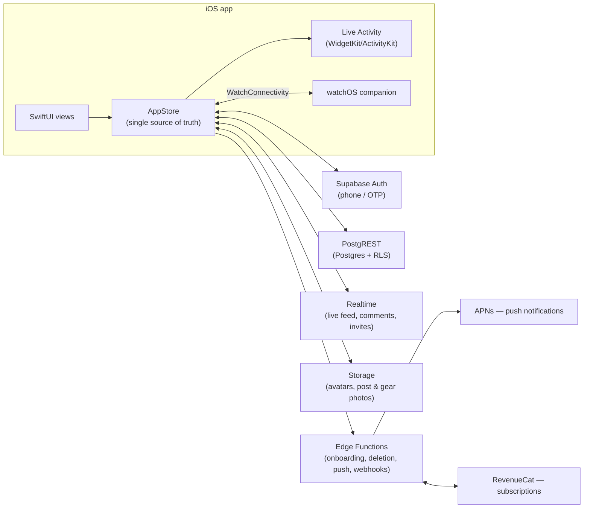

<div align="center">

# piclr

**Social pickleball tracking for iPhone.** Score live matches, keep a
running record with your crew, and watch your stats build into rivalries,
streaks, and milestones.

[](https://apps.apple.com/us/app/piclr/id6790183272)
&nbsp;




</div>

## What is piclr?

piclr is the app my pickleball group actually uses to keep score. Start a
live session and log matches point-by-point as you play — on your phone or
your Apple Watch — then post the recap to a feed your friends see. Every
match quietly feeds your record: head-to-head rivalries, win streaks,
best partners, weekly goals, and a shelf of milestones that unlock as you
play more. It's part scorekeeper, part Strava for pickleball.

It's a real, shipping product — not a demo. It's live on the App Store,
built on infrastructure (RLS on every table, realtime subscriptions, push
notifications, StoreKit billing) meant for actual usage, not a portfolio
piece.

> **The screens below use seeded demo data** — fake players and matches
> created for these screenshots, not real users.

## Screenshots

<table>
<tr>
<td width="25%"><br><sub align="center"><b>Feed</b> — following + discover, likes, comments</sub></td>
<td width="25%"><br><sub><b>Live scoring</b> — log matches as you play</sub></td>
<td width="25%"><br><sub><b>Record</b> — win/loss, best partners, rivals</sub></td>
<td width="25%"><br><sub><b>Milestones</b> — progression across match/streak tracks</sub></td>
</tr>
<tr>
<td width="25%"><br><sub><b>Comments</b> — threaded replies, mentions, likes</sub></td>
<td width="25%"><br><sub><b>Notifications</b> — follow requests + activity</sub></td>
<td width="25%"><br><sub><b>Discover</b> — suggested athletes, mutual friends</sub></td>
<td width="25%"><br><sub><b>Player profile</b> — gear, sessions, follow graph</sub></td>
</tr>
</table>

## Features

**Play & score**
- Start a live session and log matches (singles/doubles) point-by-point as you play, or back-fill a session after the fact
- Score from your wrist — a watchOS companion mirrors the live match and syncs scores back to the phone
- A lock-screen Live Activity keeps the running score visible without opening the app

**Social**
- A following/discover feed of matches, with likes, threaded comments, mentions, and reposts
- A directional follow graph (follows + requests) with private accounts
- Session invites and block/report tools

**Stats & progression**
- Win–loss record, win rate, streaks, and per-partner breakdowns
- Head-to-head rivalries that update live as you play someone repeatedly
- A milestone shelf (matches played, weekly streaks, win streaks, rivalries) with visual progress tracks
- Weekly recap ("wrapped"), a crew leaderboard, and Pro-tier deep insights (clutch record, point margin, best court)

**The rest**
- A gear locker for tracking paddles, shoes, and balls
- Push notifications for likes, comments, follows, and rivalry moments
- RevenueCat-powered subscriptions with a full paywall and StoreKit testing setup

## Under the hood

A native SwiftUI app talking to a Supabase backend, with a watchOS
companion and a WidgetKit/ActivityKit extension sharing code with the
main app.

| | |
|---|---|
| **Client** | Swift 5, SwiftUI, iOS 17+, watchOS 10+ — no cross-platform framework |
| **State** | A single `@MainActor` `AppStore`, split across domain extensions (auth, feed, sessions, comments, follow graph, realtime, …) |
| **Backend** | Supabase — Postgres + RLS, PostgREST, Realtime, Storage, Auth (phone/OTP), Deno Edge Functions |
| **Payments** | RevenueCat + StoreKit, with a stubbed paywall for DEBUG builds without live credentials |
| **Wearable** | watchOS app synced over `WatchConnectivity`; shared models live in a dependency-free `Shared/` target |
| **Live UI** | ActivityKit Live Activity for the in-progress session, driven from the same session state |
| **Analytics** | PostHog, routed through a single `Analytics` wrapper — no raw SDK calls in views |
| **Tooling** | XcodeGen-generated project, SwiftLint with custom tripwire rules enforced in CI, XcodeBuildMCP-driven UI verification (no test target — every change is proven by driving the real app on a simulator) |



Some engineering choices worth calling out:

- **One state object, split by domain.** `AppStore` owns every piece of
  `@Published` state and every network call, but the ~3,500-line class is
  split across 14 files by feature (`AppStore+Feed.swift`,
  `AppStore+Realtime.swift`, …) so ownership stays legible as the app grows.
- **RLS on every table**, checked against 62 timestamped migrations that are
  the schema's actual source of truth — not an ORM's model definitions.
- **Realtime subscriptions debounce into refreshes**, not row patches — five
  channels (sessions, notifications, follows, invites, comments) stay simple
  because they never try to reconcile partial state.
- **No test target.** Verification means building and driving the actual
  app against the accessibility tree via XcodeBuildMCP — every UI change
  ships with a real simulator screenshot, not just a green build.
- **CI-pinned SwiftLint** with custom rules (design-system tripwires like
  hardcoded colors, storage-path casing, avatar-linking conventions) that
  are verified to have zero violations before they land.

## Getting started

Requires Xcode 16+, [XcodeGen](https://github.com/yonaskolb/XcodeGen)
(`brew install xcodegen`), and a Supabase project.

```sh
# 1. Configure Supabase (gitignored — the app shows a "config needed" screen without it)
cp PickleballAI/Supabase.example.plist PickleballAI/Supabase.plist
#    …then fill in SUPABASE_URL and SUPABASE_ANON_KEY

# 2. Generate the Xcode project (required after every project.yml or file add/remove)
xcodegen generate

# 3. Build for the simulator
xcodebuild -project PickleballAI.xcodeproj -scheme PickleballAI \
  -destination 'platform=iOS Simulator,name=iPhone 17 Pro' build

# 4. Install + launch on a booted simulator
APP=$(find ~/Library/Developer/Xcode/DerivedData -path "*Debug-iphonesimulator/PickleballAI.app" -maxdepth 8 | head -1)
xcrun simctl install booted "$APP" && xcrun simctl launch booted com.pickleball.ai
```

> `PickleballAI.xcodeproj` is **generated** from `project.yml` — never
> hand-edit it, and declare all `Info.plist` keys in `project.yml`.

Backend setup: apply `supabase/migrations/` in order (this is the schema source
of truth) and deploy the functions in `supabase/functions/`. See
[docs/BACKEND.md](docs/BACKEND.md).

Optional: `cp PickleballAI/RevenueCat.example.plist PickleballAI/RevenueCat.plist`
to develop the paywall against real RevenueCat offerings (DEBUG builds
otherwise use a stubbed paywall).

### Repo map

| Path | What it is |
|---|---|
| `PickleballAI/` | The iOS app — SwiftUI views + the `AppStore` state layer |
| `PickleballAIWidget/` | WidgetKit extension for the live-session lock-screen activity |
| `PickleballAIWatch/` | watchOS tap-to-score companion app |
| `Shared/` | Dependency-free models compiled into both app and watch |
| `supabase/` | Migrations (source of truth), Deno edge functions, DB tests |
| `scripts/` | `lint.sh` (SwiftLint tripwires), `testflight.sh` (release upload) |
| `project.yml` | XcodeGen project definition — targets, plist keys, versions |
| `docs/` | Deeper documentation (below) |

### Documentation

- [docs/ARCHITECTURE.md](docs/ARCHITECTURE.md) — targets, the `AppStore`
  state layer, data models, live session / watch / push flows
- [docs/BACKEND.md](docs/BACKEND.md) — Supabase migrations, edge functions,
  RLS conventions
- [docs/CONVENTIONS.md](docs/CONVENTIONS.md) — UI consistency contract, lint
  tripwires
- [docs/VERIFICATION.md](docs/VERIFICATION.md) — how changes get proven to
  work without a test target
- [docs/RELEASE.md](docs/RELEASE.md) — TestFlight uploads, signing, StoreKit
  testing
- [CLAUDE.md](CLAUDE.md) — entry point for AI coding agents

### Verification

There is no test target. Verification = build succeeds + a simulator
screenshot for UI changes (`xcrun simctl io booted screenshot shot.png`), plus
`scripts/lint.sh` (enforced in CI on PRs).
